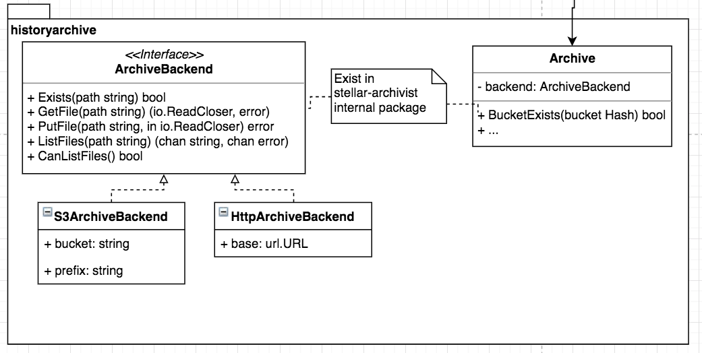
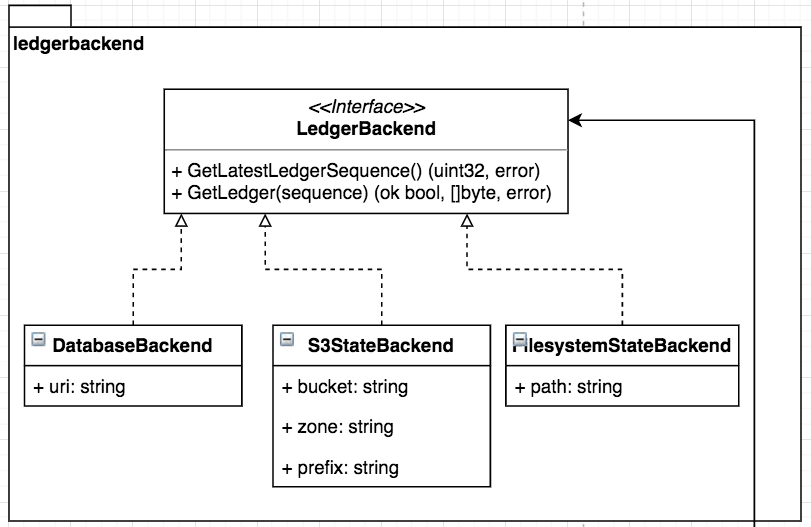
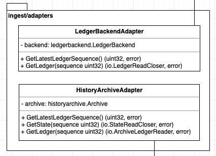
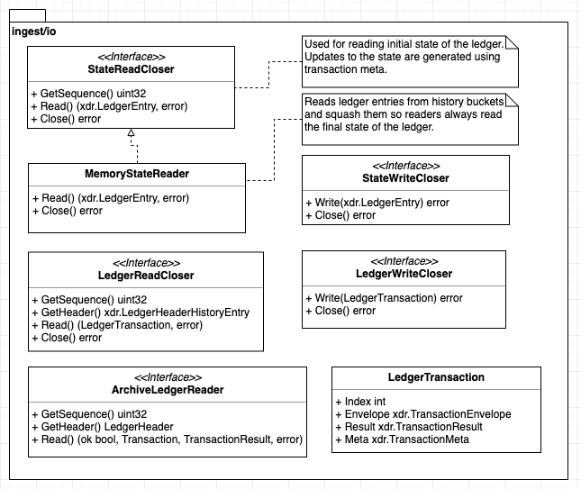
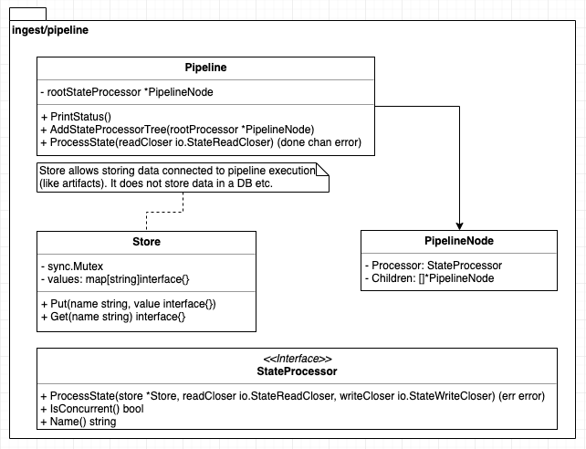
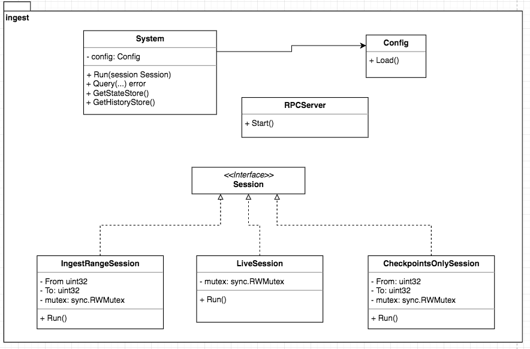

# New Aurora Ingest

This describes the goals, design, and implementation plan for the new Aurora ingestion system.

## Project Goals

- Handle need for Aurora to re-ingest, catch up after outage, or fill gaps
- No more hcnet-core DB access from Aurora
- Full history ingestion of Hcnet Public Network ledger shouldn’t take longer than 24h on x1.32xlarge AWS machine
- Aurora maintains own state of the ledger. Order books, at least, need to be kept in-memory to allow fast pathfinding.
- Multi-writer ingestion is provided for re-ingestion (speed) and for ledger stream (high availability)
- Ingestion is a collection of micro-services (trade aggregations, trades, txn history, etc…)
- Support plugins, so 3rd parties can implement custom ingestion schemes and easily plug them in
- Can run as standalone process, separate from Aurora
- Has clear API for building clients on top of it

## Design

### Inputs

The ingestion system will read data from two sources:

1. A History Archive <sup>[1](https://www.hcnet.org/developers/hcnet-core/software/admin.html#history-archives),[2](https://github.com/HashCash-Consultants/hcnet-core/blob/master/docs/history.md)</sup>, which is generated by `hcnet-core` and provides a complete copy of a recent [ledger](https://www.hcnet.org/developers/guides/concepts/ledger.html) as well as a history of `TransactionResult` XDR objects, which in turn contain [operation results](https://github.com/HashCash-Consultants/hcnet-core/blob/master/src/xdr/Hcnet-transaction.x#L382-L834).
2. A full ledger reader, which provides random and up-to-date access to the transaction sets & [`TransactionMeta`](https://github.com/HashCash-Consultants/hcnet-core/blob/master/src/xdr/Hcnet-ledger.x#L271-L318) in each ledger close. `TransactionMeta` info is essential for keeping a view of the ledger state up to date, as it describes the changes to ledger state that result from each operation.

#### History Archive Reader

The ingestion system needs to provide a full copy of current ledger state so that Aurora and other consumers of the ingestion system have no need to access the `hcnet-core` database. The history archive reader allows ingestion to read the (near) current ledger state from a history archive. The advantage of this approach is that ingestion puts no load on the `hcnet-core` database to pull in ledger state, since it reads entirely from a history archive, which is often stored in S3 or a separate file system.

For context, a `hcnet-core` can be configured to write out a history archive, which stores snapshots of the ledger state every 64 ledgers (approximately every 5 minutes). We envision that an administrator will run a `hcnet-core`, configure it to write out a history archive, and then point the ingestion system at that history archive. This has two advantages:

1. The ingestion does not put load on any external service (like SDF's history archives)
2. The administrator does not need to trust third party history archives

Typically, the ingestion system will only access the history archive on startup to get a full copy of ledger state, and will then keep that copy of ledger state up to date using data from the separate ledger transaction set backend. However, the ingestion system could access older snapshots to construct a history of ledger state, or it could periodically re-ingest the full ledger state to detect any errors that accumulate over time from updating the ledger state.

The history archive reader supports multiple backends to handle different ways that a history archive can be stored:

1. S3 backend
2. HTTP backend
3. File backend

UML Class diagram



Example of reading a history archive using `hcnet-core`:

```sh
wget http://history.hcnet.org/prd/core-live/core_live_001/results/01/4d/f7/results-014df7ff.xdr.gz
gunzip results-014df7ff.xdr.gz
~/src/hcnet-core/src/hcnet-core dump-xdr results-014df7ff.xdr | head -n 40
```

#### Full Ledger Reader

The ingestion system needs a way to keep the current ledger state up to date, as well as a way to construct a history of events (typically transactions, operations, and effects) that have occurred over time on the Hcnet network. The full ledger reader provides this ability. Specifically, it allows the ingestion system to access a stream of transaction metadata that encode state changes that happen as a result of every transaction. This information is missing from the history archives, and is also updated after every ledger close (vs. after every 64 in the history archives). The full ledger reader also has access to transaction sets for each ledger.

Here's a summary of the features provided by the full ledger reader vs. the history archive reader:

| Reader | txn resultsets | ledger state snapshots | transaction metadata | near-realtime (updates at every ledger close) |
| --- |:---:|:---:|:---:|:---:|
| history archive | X | X | | |
| full ledger | X | | X | X |

The long term plan for the full ledger reader is for `hcnet-core` to write transaction metadata out to an S3 bucket, which will allow the following:

1. Reading transaction metadata without creating load on `hcnet-core`'s database
2. Fast, parallel access to historical transaction metadata (allowing fast `CATCHUP_COMPLETE` ingestion)
3. Multiple `hcnet-core`s writing the latest update to the same S3 object. This allows redundancy: one `hcnet-core` can fail, and the stream of S3 objects will continue uninterrupted.

However, this requires a change to `hcnet-core`, which is estimated to happen in Q3 2019. Until then, the ingestion system will read from the `txfeehistory` and [`txhistory`](https://github.com/HashCash-Consultants/hcnet-core/blob/master/src/transactions/TransactionFrame.cpp#L683) tables in the `hcnet-core` database as it does currently. Unfortunately, we won't get any of the benefits listed above until the change is made to `hcnet-core`.

The full ledger reader will support multiple backends:

1. `hcnet-core` database reader (this will be implemented first, and is exactly what happens now)
2. File backend
3. S3 backend

UML Class diagram



### Data Transformation

The ingestion system has a data transformation pipeline in between its inputs (full ledger backend + history archive backend), and its outputs.

#### Input Adapters

The first step is to adapt the format of the data flowing from the two input backends into a format & interface that is easy for the ingestion system to use for both random access, and accessing the latest data.

UML Class diagram



Notes:

- the `HistoryArchiveAdapter` supports both reading a ledger transaction result set via `GetLedger()` and reading ledger state via `GetState()`.
- Both adapters support `GetLatestLedgerSequence()`, which allows a consumer to look up the most recent ledger information in the backend.
- The adapters, rather than returning state and ledgers as objects stored in memory, return them as `ReadCloser` objects. This is because the ledger state or a particular transaction state may not fit in memory, and must be processed as a stream.

Both `ReadCloser` and `WriteCloser` interfaces include `Close()` method. When `Close()` is called on `ReadCloser` it tells the reader that no more data is needed and it should stop streaming, ex. close buffered channels, close network connections, etc. When `Close` is is called on `WriteCloser` it means that no more data will be written to it. This is especially helpful when writer is writing to a pipe so the reader on the other end knows that no more objects will be streamed and can return `EOF`.

The `ReadCloser` structs come from the `ingest/io` package, shown in the UML class diagram below:



#### Ingestion Pipeline

At the center of ingestion is a `Pipeline`, which is initialized with a series of processors for each kind of data that ingestion handles (ledger state, a full ledger update, and an archive ledger update). Each processor implements a function that reads data from a `ReadCloser`, processes/filters it, and writes it to a `WriteCloser`. A few example processors:

- A processor that passes on only information about a certain account
- A processor that only looks at certain kinds of events, such as offers being placed
- A processor sending a mobile notification for incoming payments
- A processor saving data to a database or in-memory store.

See the rough UML diagram:



Notes:

- The processors form a tree and are processed from root to leaves.
- Processing does not change the type of the data, but it can remove or change fields in the data
- Processors can write/read artifacts (ex. average balances) in a `Store` that is shared between all processors in a pipeline. `Store` is ephemeral, its contents is removed when pipeline processing is done.

### Tying it all together

The ingestion system can run as a stand-alone process or as part of a larger process like Aurora. It can handle three different kinds of sessions:

- `IngestRangeSession`: ingest data over a range of ledgers. Used for ingesting historical data in parallel
- `LiveSession`: ingest the latest ledgers as soon as the close. This is the standard operating mode for a live Aurora instance
- `CheckpointsOnlySession`: ingest only history archive checkpoint data.

Sessions are responsible for coordinating pipelines and ensuring data is in sync. When processors write to a single storage type, keeping data in sync is trivial. For example, for Postgres processors can share a single transaction object and commit when processing is done. However, there's also a significant challenge keeping data in sync when processors are writing to different storage types: any read operation that reads across stores or across data updated by multiple `Processes`s is at risk of reading inconsistent values. `System` or `Session` objects (TBD) should be responsible by keeping different stores in sync. For example: they can ensure that all queries sent to stores have the latest ledger sequence that was successfully saved all stores appended. This probably requires stores to keep data for the two (2) latest ledgers.



## Open questions

There are several open questions, and the design above isn't comprehensive. A few questions below:

- What is the story around ingestion plugins? How do developers use the ingestion system in their own projects?
- How do we enable ingestion via multiple languages?
- Will we split Aurora into an ingestion process and an API server process, or keep a single process?
- Should a stand-alone ingestion process expose an RPC server or a more standard REST API?
  - What's the exact API that an ingestion server exposes?
- Where is parallel ingestion logic handled?
- How exactly do we organize `Store`s, `ProcessingPipeline`, and `Process`es?
- How do we keep reads from multiple stores consistent?
- How do we make the `Store`s and `Process`es in `ingest/stores` reusable?

## Implementation Plan

This gives an overview of how we could move Aurora over to using the new ingestion system.

### As we implement components

We can create a command-line tool that computes basic stats and exercises all the components of ingestion to prove that they work together. For example, the tool can compute the total number of accounts every 5 minutes, or compute the number of transactions per second.

### The proof of concept

We can implement [accounts for signer](https://github.com/HashCash-Consultants/go/issues/432) using the new ingestion system. It's a good candidate because it's something we urgently need, and it's a new feature, so we don't risk breaking anything existing if there's an issue with the system.

### Chunks that can be broken off and implemented separately

- The projects below depend on the `io` package interfaces, which should be pretty minimal to add.
- History Archive Backend and History Archive Adapter (Nikhil is already on this)
  - command-line tool takes a history archive file and prints out basic stats like # of accounts and transactions per second 
- `DatabaseBackend` implementation of `LedgerBackend` and `LedgerBackendAdapter`
  - command-line tool takes a database URI and computes stats like # of transactions in the latest ledger (it runs live and updates with each new ledger in the `DatabaseBackend`)
- `ingest/pipeline`:
  - command-line tool that implements a few demo processors and given a DB URL and/or a historyarchive file location, streams out the data that passes the filter

Once the above are all done, put together a basic ingestion server as laid out in the top-level `ingest` package.

At this point, we'll have a full end-to-end implementation! Next, we start filling in the extra features we didn't need for the proof of concept. Once it's reasonably stable, we can release Aurora with the new `accoutns for signer` feature to get some real-world testing.

### Porting the rest of Aurora over

Once the proof of concept is functional, tables / features can be ported over one by one. Features that depend on `hcnet-core` tables currently can be moved to equivalent tables maintained by Aurora. I imagine most features will still use postgres, but a few, such as pathfinding, will need in-memory storage for speed. If pathfinding can maintain a copy of order books [in memory](https://github.com/HashCash-Consultants/go/issues/849) it should run orders of magnitude faster. Aurora should be split out into a microservices architecture, with each feature implemented using a different `StateInitProcess` or `LedgerProcess` object.
